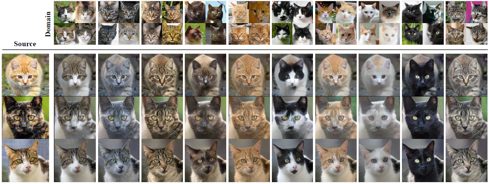
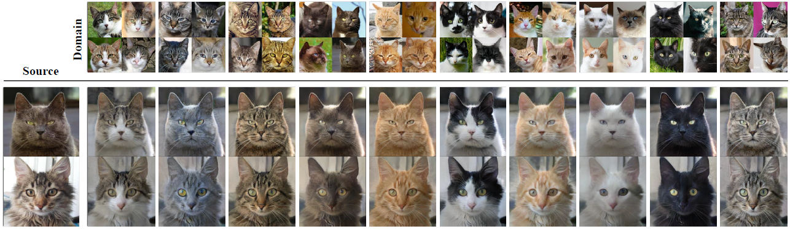
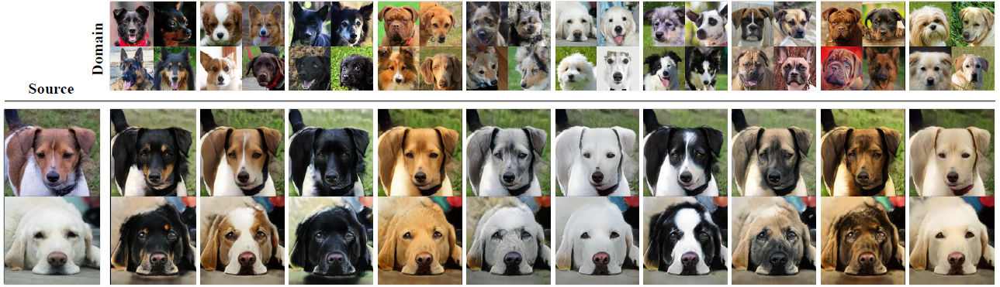
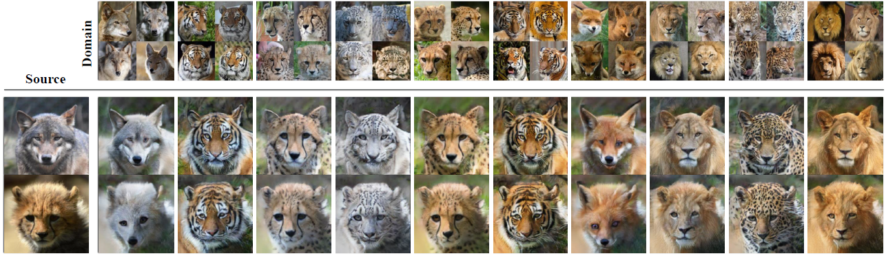
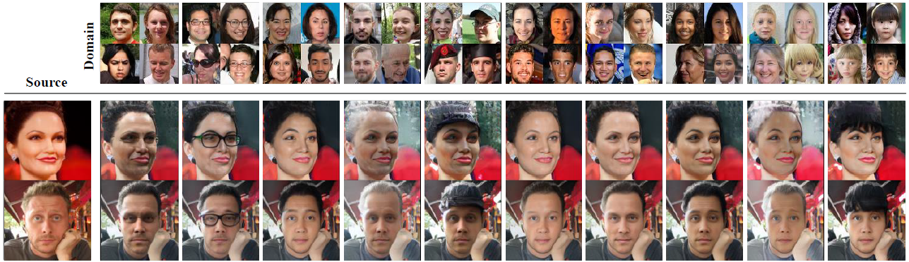
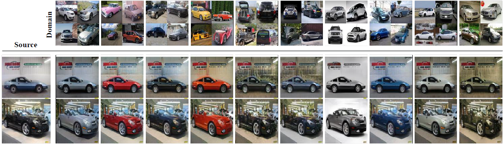

## Rethinking the Truly Unsupervised Image-to-Image Translation<br/>(ICCV 2021)

> **_Each image is generated with the source image in the left and the average style vector of each cluster. The network is trained under fully unsupervised manner._**

__Official pytorch implementation of "Rethinking the Truly Unsupervised Image-to-Image Translation"__

> __[Rethinking the Truly Unsupervised Image-to-Image Translation](https://arxiv.org/abs/2006.06500)__   
> Kyungjune Baek<sup>1</sup>*, Yunjey Choi<sup>2</sup>, Youngjung Uh<sup>1</sup>, Jaejun Yoo<sup>3</sup>, Hyunjung Shim<sup>1</sup>  
> \* Work done during his internship at Clova AI Research  
> <sup>1</sup> Yonsei University  
> <sup>2</sup> NAVER AI Lab.  
> <sup>3</sup> UNIST   
>  
> __Absract__ _Every recent image-to-image translation model inherently requires either image-level (i.e. input-output pairs) or set-level (i.e. domain labels) supervision. However, even set-level supervision can be a severe bottleneck for data collection in practice. In this paper, we tackle image-to-image translation in a fully unsupervised setting, i.e., neither paired images nor domain labels. To this end, we propose a truly unsupervised image-to-image translation model (TUNIT) that simultaneously learns to separate image domains and translates input images into the estimated domains. Experimental results show that our model achieves comparable or even better performance than the set-level supervised model trained with full labels, generalizes well on various datasets, and is robust against the choice of hyperparameters (e.g. the preset number of pseudo domains). Furthermore, TUNIT can be easily extended to semi-supervised learning with a few labeled data._

### Requirement 
__Library__
```
pip install -r requirements.txt

* pytorch==1.1.0 or 1.2.0  
* tqdm  
* opencv-python  
* scipy  
* sklearn
* matplotlib  
* pillow  
* tensorboardX 
```

__Dataset__  
* This repo. utilizes the variant of "ImageFolder".
* Download : [AFHQ (StarGANv2)](https://www.dropbox.com/s/t9l9o3vsx2jai3z/afhq.zip?dl=0) / [AnimalFaces (FUNIT)](https://github.com/NVlabs/FUNIT)
* Example directory hierarchy (AFHQ, AnimalFaces): 
```
Project
|--- tunit
|          |--- main.py
|          |--- train
|                 |--- train_unsupervised.py
|                 |--- ...
|
|--- data
       |--- afhq
             |--- train
             |--- test
       |--- animal_faces
             |--- n02085620
             |--- n02085782
             |--- ...
       |--- ffhq
             |--- images
                    |--- 000001.jpg
                    |--- ...
       |--- lsun_car
             |--- images
                    |--- 000001.jpg
                    |--- ...

Then, call --data_path='../data'
```

__Hardware__
* This source code is mainly tested on V100 and P40.

## How to Run (Quick Start)
After setting the dataset directory, the code can be easily run by the scripts below.

__Train on local__
```
Supervised
python main.py --gpu $GPU_TO_USE --p_semi 1.0 --dataset animal_faces --data_path='../data'

Semi-supervised
python main.py --gpu $GPU_TO_USE --p_semi 0.5 --dataset animal_faces --data_path='../data'

Unsupervised
python main.py --gpu $GPU_TO_USE --p_semi 0.0 --dataset animal_faces --data_path='../data'
```

__Test on local__
```
python main.py --gpu $GPU_TO_USE --validation --load_model $DIR_TO_LOAD --dataset animal_faces
```

__Monitoring__
```
tensorboard --logdir=$DIR/events --port=$PORT
```

__Actual example__
```
Train
python main.py --gpu 0 --dataset animal_faces --output_k 10 --data_path '../data' --p_semi 0.0
python main.py --gpu 0 --dataset animal_faces --output_k 10 --data_path '../data' --p_semi 0.2
python main.py --gpu 0 --dataset afhq_cat --output_k 10 --data_path '../data' --p_semi 0.0
python main.py --gpu 1 --dataset animal_faces --data_path '../data' --p_semi 1.0
python main.py --gpu 0,1 --dataset summer2winter --output_k 2 --data_path '../data' --p_semi 0.0 --img_size 256 --batch_size 16 --ddp

Test
python main.py --gpu 0 --dataset animal_faces --output_k 10 --data_path '../data' --validation --load_model GAN_20190101_101010
python main.py --gpu 1 --dataset afhq_cat --output_k 10 --data_path '../data' --validation --load_model GAN_20190101_101010
python main.py --gpu 2 --dataset summer2winter --output_k 2 --data_path '../data' --validation --load_model GAN_20190101_101010

Monitoring - open terminal at ./tunit/logs
tensorboard --logdir=./GAN_20200101_101010/events
```

## Pretrained Model
### Download
[One Drive](https://1drv.ms/u/s!AprVWp5MreFV8BLY22ias4Gt1ZtO?e=IYsUwX)
* Download folders to load, then place the folder under 'logs'.
* Links of google drive are deprecated.
```
Project
|--- tunit
|          |--- main.py
|          |--- logs
|                 |--- animalFaces10_0_00
|                               |--- checkpoint.txt
|                               |--- model_4568.ckpt
|          |--- train
|                 |--- train_unsupervised.py
|                 |--- ...

Then, RUN
python main.py --gpu 0 --dataset animal_faces --output_k 10 --img_size 128 --data_path $DATAPATH --validation --load_model animalFaces10_0_00 --p_semi 0.0
```
### How to run
```
AFHQ Cat
python main.py --gpu 0 --dataset afhq_cat --output_k 10 --img_size 128 --data_path $DATAPATH --validation --load_model afhq_cat_128
python main.py --gpu 0 --dataset afhq_cat --output_k 10 --img_size 256 --data_path $DATAPATH --validation --load_model afhq_cat_256
```
```
AFHQ Dog
python main.py --gpu 0 --dataset afhq_dog --output_k 10 --img_size 128 --data_path $DATAPATH --validation --load_model afhq_dog_128
python main.py --gpu 0 --dataset afhq_dog --output_k 10 --img_size 256 --data_path $DATAPATH --validation --load_model afhq_dog_256

```
```
AFHQ Wild
python main.py --gpu 0 --dataset afhq_wild --output_k 10 --img_size 128 --data_path $DATAPATH --validation --load_model afhq_wild_128
python main.py --gpu 0 --dataset afhq_wild --output_k 10 --img_size 256 --data_path $DATAPATH --validation --load_model afhq_wild_256
```
```
AnimalFaces-10
python main.py --gpu 0 --dataset animal_faces --output_k 10 --img_size 128 --data_path $DATAPATH --validation --load_model animalFaces10_0_00 --p_semi 0.0
python main.py --gpu 0 --dataset animal_faces --output_k 10 --img_size 128 --data_path $DATAPATH --validation --load_model animalFaces10_0_20 --p_semi 0.2
```

## Explanation for codes
The validation generates 200 images per args.iters iterations. To reduce the number of images, please adjust the validation frequency. The checkpoint file is saved per ((args.epochs//10) * args.iters) iterations. Or comment out validation.py#L81 to validation.py#L162.

* For more classes on AnimalFaces, change the list at main.py#L227 then, set args.output_k to len(args.att_to_use)
    * ex) args.att_to_use = \[i for i in range(100)\] then, run: python main.py --output_k 100 ...

### Arguments
* batch_size, img_size, data_path and p_semi are frequently speified.
* Please refer "help" of the arguments in main.py.

### Code Structure
* main.py
    * Execute main.py to run the codes.
    * The script builds networks, optimizers and data loaders, and manages the checkpoint files.
* datasets
    * custom_dataset.py
        * Basically, it is the same as ImageFolder but contains remap procedure of class numbers.
    * datasetgetter.py
        * Returns dataset instance of the dataset specified by args.dataset.
        * The instance returns original image, transformed image and its ground truth label.
* models
    * blocks.py
        * Blocks for building networks.
        * This code is based on FUNIT repos.
    * guidingNet.py
        * Definition of guiding network.
    * discriminator.py
        * Definition of discriminator.
        * The architecture is based on StarGANv2, but it contains two residual blocks for each resolution.
    * generator.py
        * Definition of generator.
        * It consists of decoder, content encoder and MLP for AdaIN.
        * This code is from FUNIT repos.
* train
    * train_unsupervised.py
        * It is called by setting --p_semi to 0.0
        * This mode does not utilize the labels at all. 
    * train_supervised.py
        * It is called by setting --p_semi to 1.0
        * This mode fully utilizes the labels.
    * train_semisupervised.py
        * It is called by setting --p_semi between 0.0 to 1.0.
        * This mode utilizes (--p_semi * 100)% labels.
* validation
    * cluster_eval.py
    * eval_metrics.py
        * These two scripts contain the functions for evaluating the classification performance.
        * These are from IIC repos.
    * plot_tsne.py (can be removed)
        * For plotting t-SNE.
    * validation.py
        * Generate fake samples and calculate FID.
* tools
    * utils.py
        * Functions and class for logger, make folders, averageMeter and add logs.
    * ops.py
        * Queue operation and loss functions.
* resrc
    * For image files of README.md

You can change the adversarial loss by modifying calc_adv_loss in ops.py. For the different strategy of training, please refer the files in train.

## Results





> **_Each image is generated with the source image in left and the average vector of reference images. The network is trained under fully unsupervised manner._**


## License
TUNIT is distributed under MIT unless the header specifies another license. 

```
Copyright (c) 2020-present NAVER Corp.

Permission is hereby granted, free of charge, to any person obtaining a copy
of this software and associated documentation files (the "Software"), to deal
in the Software without restriction, including without limitation the rights
to use, copy, modify, merge, publish, distribute, sublicense, and/or sell
copies of the Software, and to permit persons to whom the Software is
furnished to do so, subject to the following conditions:

The above copyright notice and this permission notice shall be included in
all copies or substantial portions of the Software.

THE SOFTWARE IS PROVIDED "AS IS", WITHOUT WARRANTY OF ANY KIND, EXPRESS OR
IMPLIED, INCLUDING BUT NOT LIMITED TO THE WARRANTIES OF MERCHANTABILITY,
FITNESS FOR A PARTICULAR PURPOSE AND NONINFRINGEMENT.  IN NO EVENT SHALL THE
AUTHORS OR COPYRIGHT HOLDERS BE LIABLE FOR ANY CLAIM, DAMAGES OR OTHER
LIABILITY, WHETHER IN AN ACTION OF CONTRACT, TORTd OR OTHERWISE, ARISING FROM,
OUT OF OR IN CONNECTION WITH THE SOFTWARE OR THE USE OR OTHER DEALINGS IN
THE SOFTWARE.
```

The pretrained models is covered by Creative Commons BY-NC 4.0 license by NAVER Corporation. 
You can use, copy, tranform and build upon the material for non-commercial purposes as long as you give appropriate credit by citing our paper, and indicate if changes were made.

## Citation
If you find this work useful for your research, please cite our paper:
```
@InProceedings{Baek_2021_ICCV,
    author    = {Baek, Kyungjune and Choi, Yunjey and Uh, Youngjung and Yoo, Jaejun and Shim, Hyunjung},
    title     = {Rethinking the Truly Unsupervised Image-to-Image Translation},
    booktitle = {Proceedings of the IEEE/CVF International Conference on Computer Vision (ICCV)},
    month     = {October},
    year      = {2021},
    pages     = {14154-14163}
}
```
